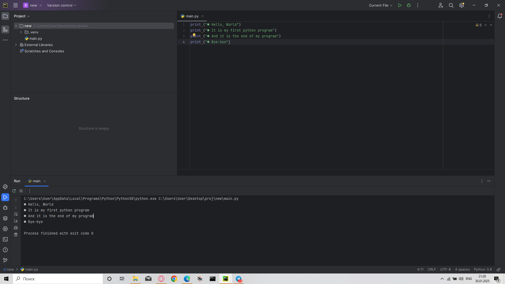

# My First Python Program

## Описание
Это моя первая программа на Python. Она выводит несколько строк текста.

## Код программы
```python
print("● Hello, World")
print("● It is my first python program")
print("● And it is the end of my program")
print("● Bye-bye")
```

## Вывод
При запуске программа выведет в консоль:
```
● Hello, World
● It is my first python program
● And it is the end of my program
● Bye-bye
```

