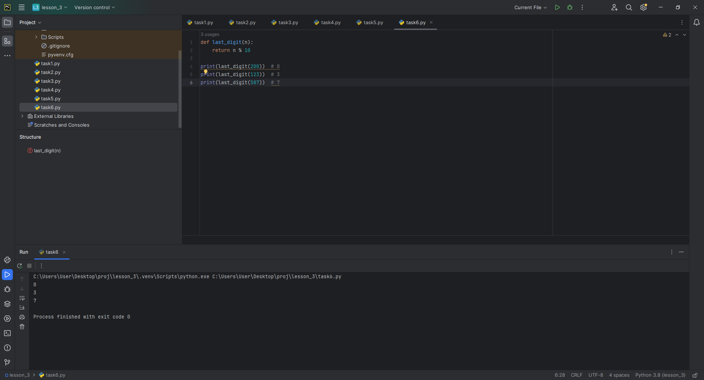

## 1. Операции с целочисленными переменными
Даны три целочисленные переменные. Необходимо выполнить следующие операции:
- Найти **сумму** переменных.
- Найти **разность** первой и второй переменной.
- Найти **произведение** переменных.
- Вычислить выражение: от **первой переменной отнять вторую и прибавить третью**.
- Разделить **произведение двух переменных на третью**.
- Найти **остаток от деления суммы первых двух переменных на третью переменную**.

**Решение:**

# Входные данные
a, b, c = 10, 5, 2

# Операции
sum_abc = a + b + c
sub_ab = a - b
mul_abc = a * b * c
expr = a - b + c
prod_div = (a * b) / c if c != 0 else 'Ошибка: деление на ноль'
mod_sum = (a + b) % c if c != 0 else 'Ошибка: деление на ноль'

# Вывод результатов
print(sum_abc, sub_ab, mul_abc, expr, prod_div, mod_sum)
```


---

## 2. Прямоугольный треугольник
Даны катеты **cat_a** и **cat_b**. Найти:
- **Площадь треугольника**.
- **Гипотенузу**.

**Решение:**
```python
import math

cat_a, cat_b = 3, 4
area = (cat_a * cat_b) / 2
hypotenuse = math.sqrt(cat_a**2 + cat_b**2)

print(area, hypotenuse)
```


---

## 3. Подсчет количества слов в строке
Дана строка, состоящая из слов, разделенных пробелами. Определите количество слов.

**Решение:**
```
def count_words(s):
    return len(s.split())

print(count_words('Hello world'))
print(count_words('a bc'))
print(count_words('test'))
print(count_words('test1 test2 test3 test4 test5'))
```


---

## 4. Замена символов в строке
Дана строка. Необходимо заменить все вхождения буквы **'h'** на **'Н'**, кроме **первого и последнего**.

**Решение:**
```
def replace_h(s):
    first = s.find('h')
    last = s.rfind('h')
    return s[:first+1] + s[first+1:last].replace('h', 'Н') + s[last:]

print(replace_h('hhhabchghhh'))
```


---

## 5. Работа со строками
Дана строка. Выполните следующие действия:
1. Выведите **третий символ** строки.
2. Выведите **предпоследний символ** строки.
3. Выведите **первые пять символов** строки.
4. Выведите **всю строку, кроме последних двух символов**.
5. Выведите **все символы с четными индексами** (нумерация с 0, т.е. начиная с первого).
6. Выведите **все символы с нечетными индексами** (начиная со второго символа строки).
7. Выведите **все символы в обратном порядке**.
8. Выведите **все символы через один в обратном порядке, начиная с последнего**.
9. Выведите **длину строки**.

**Решение:**
```
s = 'Hello'
print(s[2])  # 3-й символ
print(s[-2])  # Предпоследний символ
print(s[:5])  # Первые 5 символов
print(s[:-2])  # Всё кроме последних 2 символов
print(s[::2])  # Четные индексы
print(s[1::2])  # Нечетные индексы
print(s[::-1])  # Обратный порядок
print(s[::-2])  # Через один в обратном порядке
print(len(s))  # Длина строки
```


---

## 6. Последняя цифра числа
Дано целое число. Выведите его последнюю цифру.

**Решение:**
```
def last_digit(n):
    return n % 10

print(last_digit(200))  # 0
print(last_digit(123))  # 3
print(last_digit(587))  # 7
```



---

## 7. Количество десятков в трехзначном числе
Дано трехзначное число. Найти количество десятков.

**Решение:**
```
def tens_count(n):
    return (n // 10) % 10

print(tens_count(123))  # 2
print(tens_count(978))  # 7
```


---

## 8. Сумма цифр трехзначного числа
Дано трехзначное число. Найти сумму его цифр.

**Решение:**
```
def sum_of_digits(n):
    return sum(int(digit) for digit in str(n))

print(sum_of_digits(123))  # 6
print(sum_of_digits(555))  # 15
```


